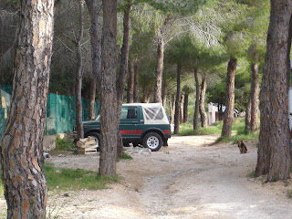
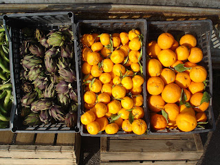
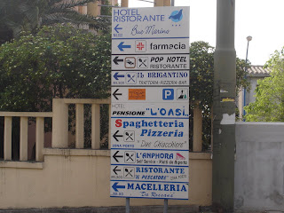
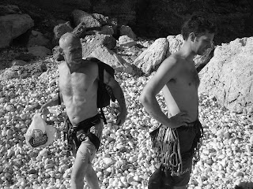
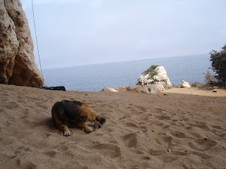
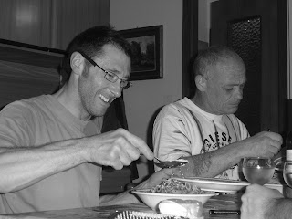

I’ve always been a light sleeper. The slightest disturbance in my surroundings will alert me and open my eyes. The thought of a long journey compounds the problem making me restless. I guess that makes me a worrier. I’ll totter around and ruminate about the travel till around bed time and then decide to pack by starting with a list. This night was different, I tried not stress by seeing friends and packing on the morning of travel which went ok since I already had my trusty notes on what to take.

Fortunately for me I live near the airport so I decided to walk to the terminal. Unfortunately for me, the brand new bag I had bought from Milton Keynes the weekend before had no wheels, so I carried it over my shoulder. Simple enough I thought, but it was a warm day and partly uphill. When I got to the terminal I was knackered and sweating.

One of the idiosyncrasies of the new airport security regulations is that you cannot take any fluids aboard with you, which is fine. Ask them for a last swig of your drink before they condemn it to the bin and they won’t let you?\*!

Did you know, that statistically air travel is supposed to be the safest way to go from A to B. To me though, it also means, fly more and you increase your chances of being on that plane that doesn’t make it. I know, this could even happen in a car, the problem is that in a plane you hand over your safety to another driver; the anonymous pilot, it a matter of trust. Every bit of noise or air turbulence made me wince and curl up, so chatting to the lady across the aisle form me (Anna) helped me to chill out. We blabbered for nearly and hour and she even gave me one of her babies to hold while she cleaned up the puke of the other.

At this time of the year the weather in Sardinia isn’t that different from a warm day sunny day this time of year in the south of England. The differences are the lower humidity, the lack of that constant noise of traffic somewhere and a sweet smell to the air due to perhaps the flowering of native plants and the sea air. The land appears semi arid and populated with both coniferous and deciduous trees and prickly pears, whose fruit I am told you can eat.

After a brief wait around to get the hire cars sorted out we left Cagliari and started on our two and a half hour journey up to the north eastern town of Cala Gonnone where we would be staying and climbing all week. We even stopped off to eat oranges from a road side stall for ten minutes since most of us hadn’t eaten since we left Luton. When we arrived it was getting dark, we dropped our bags and went to a local restaurant to eat. It was there where we me, Pep, Mike, Jes, Karim and Simon got to meet and get to know the two climbers who arrived separately; Tony and Bert (real name Brian).

The great thing about our accommodation was that it was cheap (£75 each for the week), clean and comfortable and practical. We had our own bathroom with shower and constant hot running water. The kitchen facilities had all the cutlery and dishes we needed. We were going to eat by cooking our own meals and preparing our own sandwiches, this was going to make it a very cheap holiday indeed. We decided to buy commonly and bought most of our weeks shopping with a kitty we paid twenty euros each into amongst the four of us. We headed out before breakfast on the first morning to the grocery store. At this stage I still really didn’t know what to expect from the climbing because we were going to be on limestone rocks. I didn’t even know what limestone looked like. After breakfast we packed our climbing gear into the cars and drove out to the first rockface, an outcrop about a mile or two from the beach. We parked a short distance from the base of the rock and walked the rest of the way over small boulders and rocks and through shrubs and trees. As we approached, the rock gradually filled my field vision until we came to a stop and I could see just how immense it was. Getting to most of the routes involved a steep walk and the rock itself was light grey and pocketed, not the sort for good solid handholds I was used to in the peak district.

I didn’t do as well as I hoped that day because I found it a bit of a shock. The rock was sharp and the bolts were a lot further apart than I was used too. I felt I was climbing way over my skill level even though that grades I was climbing were the level I had trained for. Still I am glad I trained the way I did, it could have been worse.

The next day we climbed at a beach cave. The weather was warm, sunny, and dry with the shhhing of the sea near by. We walked to the end of the road and down and along the beach for about a mile over rocks and sand to the cave. We were the first climbing party to arrive, accompanied all the way along the beach by a dog. It was still only early morning but the sun was hot. Fortunately we had the shade of the cave to protect us while we climbed. We also met a group of Romans on holiday for a week, we never learnt any of their names but we got as far as being on smiling and ‘thank you terms’.

The following morning we drove to another beach that had much more of a range of climbs for everyone. Once we parked the car at the top of the valley; we climbed down a laid path to the cliffss. Despite being the fourth day of climbing I still felt nervous before every climb, but this lessened as the day went on and my body loosened up and my confidence increased. I did do some of my scariest climbing on this day, the name of the route had ‘Bannana’ in it. I was met at the top by tourists on the road above admiring the scenery. They must have been able to see all the strain I was going through and the contortions of my face at every tricky move. That night we had Paella and went on a late night ice cream hunt which ended up for me at least with the best and thickest hot chocolate I have ever had.

The next two days were pretty much the same story. It started with an early rise for breakfast and onto the cliffs, then lunch and more climbing till we were exhausted and decided to go home to eat and rest. I would be doing less and less climbing as the days passed, because of the increasing pain in my feet due to the tight rock boots I was using.

Our evenings were warm and pleasant and I often stepped out to breathe the sweet air and stare at the moon before I popped back in to join in with the conversations that were taking place. I was making new friends with people who shared a common interest and getting to know people from differing backgrounds. We would go out for an evening stroll and an ice cream before heading back to the apartments. I spent the last day in the village and the beach. My body had reached the point of no return, it was telling me to taking it easy, or else!

> Walking up a mountain track, I fell to thinking. Approach everything rationally, and you become harsh. Pole along in the stream of emotions, and you will be swept away by the current. Give free rein to your desires, and you become uncomfortably confined. It is not a very agreeable place to live, this world of ours.’ - Natsume Soseki, The Three-Cornered World.
