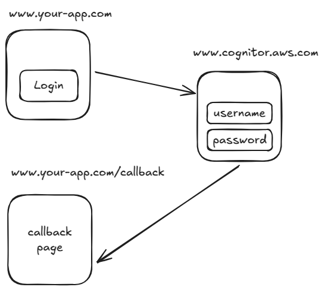
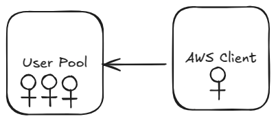
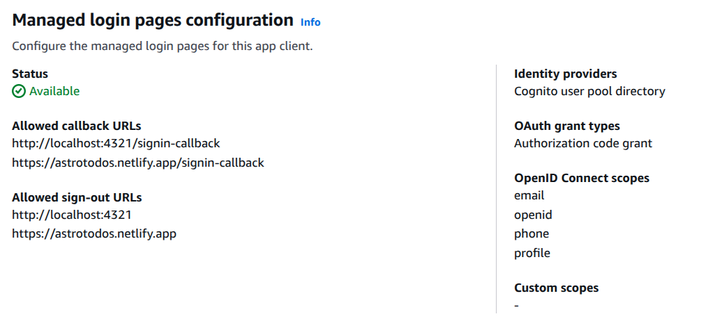

In order to help me understand how Cognito works, I built a full-stack web app for storing a list of todos for a logged-in user. You can check it out [here](https://astrotodos.netlify.app). The code is available [here](https://github.com/TimeBandit/astro-todo).

Rather than creating your own authentication system, it's usually better to use a third-party service. That way, you know you're using something built by people whose sole focus is secure authentication. It also frees you up to work on the actual goals of your app or business.

One such service is [AWS Cognito](https://aws.amazon.com/cognito/).

## How Cognito Works with Your App

Here's how Cognito integrates with your site:



1. The user clicks the login button in your app.
2. The page redirects to a login/registration page hosted by Cognito.
3. On a successful login, Cognito redirects back to your page and stores user data and tokens in session storage.

### Handling the Callback Route

The purpose of the `/callback` route is to act as an interstitial page where we process the response from Cognito after a successful login.

For example, on the `/callback` page, we could have:

```js
// /callback route
<script>
  import { serverLogin, userManager } from "@/lib/auth";

  const user = await userManager.signinCallback();

  if (user && user.access_token) {
    // Process the tokens on the server side
    serverLogin(user.access_token, user.id_token, user.expires_in);
  }

  // Redirect the browser
  window.location.href = "/todos";
</script>
```

## Setting Up Cognito

Setting up Cognito is fairly straightforward, but there are a few concepts to get your head around.



1. Once logged into your AWS account, head over to Amazon Cognito.
2. Create a new User Pool. Think of this as a container or directory for your users. You can create as many as you like—one for each application.
3. Select your new User Pool and create a new App Client. This allows your frontend to interact with Cognito, handling login, logout, and authentication.
4. Select your new client, then open the "Quick setup guide". Choose the platform you're working with—this will provide starter code to help you integrate Cognito with your app.
5. Click on the "Login pages" tab and Edit to add your Allowed callback URLs and Allowed sign-out URLs:
   - The Allowed callback URL is where Cognito should redirect after a successful login.
   - The Allowed sign-out URL is where users land after logging out.
   - In my Todos app, the callback URL is the /callback page, and the sign-out URL is the homepage.
   - You can see that i've also added url for development at localhost. This is important!



Once Cognito is set up, you can handle the result of a successful login in the `/callback` page. The code snippet above imports a userManager object. This code comes directly from the Cognito setup steps.
